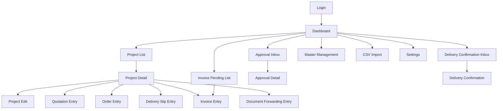

# PartWire Screen Transition Draft

## 0. Purpose

This document provides an initial screen transition draft for v1.

Principles:

- project-centric navigation is the main route
- cross-project task work uses dedicated inbox/list screens
- the default flow is list -> detail -> processing screen

## 1. Overall Flow

## 2. Main Routes

- Dashboard to project list/detail
- Project detail as the operational hub
- dedicated inboxes for approvals, delivery confirmation, and invoice-related work

## 3. Minimum Screen Set

- Login
- Dashboard
- Project List
- Project Detail
- Quotation Entry
- Approval Inbox / Detail
- Order Entry
- Delivery Slip Entry
- Delivery Confirmation
- Invoice Entry
- Forwarding Entry
- Master Management
- CSV Import
- Settings

## 4. Initial UI Policy

- use full screens for large data entry and detail review
- use dialogs for small confirmation or comment input
- return to project detail after most processing actions
- on optimistic-lock conflicts, refresh the target detail instead of returning to the list
