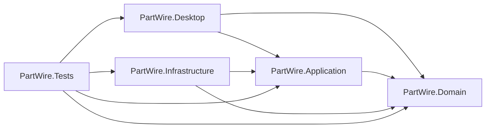

# PartWire Solution Structure Draft

## 0. Purpose

This document defines the intended solution structure at the start of implementation.

## 1. Initial Projects

- `PartWire.Desktop`
- `PartWire.Application`
- `PartWire.Domain`
- `PartWire.Infrastructure`
- `PartWire.Tests`

## 2. Dependency Direction

## 3. Responsibility by Project

- `PartWire.Desktop`: WPF app, views, view models, navigation, dialogs, desktop DI bootstrap
- `PartWire.Application`: use cases, DTOs, interfaces, validation
- `PartWire.Domain`: entities, value objects, enums, domain services, domain exceptions
- `PartWire.Infrastructure`: EF Core, repositories, queries, authentication, files, notifications, audit, numbering
- `PartWire.Tests`: unit tests and minimum integration tests

## 4. Recommended Initial Rules

- views call use cases through view models
- use cases depend on interfaces
- EF Core stays in Infrastructure
- Domain does not depend on WPF or EF Core
