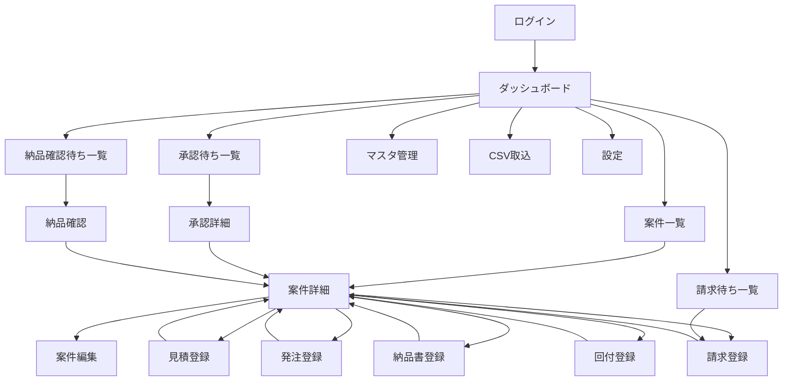

# PartWire 画面遷移案

## 0. 目的

本書は、v1 の主要導線を確認するための画面遷移初版である。

方針:

- 案件中心の導線を主軸にする
- 承認待ち、納品確認待ちなどの横断業務は専用一覧から入る
- 一覧で探し、詳細で判断し、登録画面で処理する流れを基本とする

## 1. 全体遷移

## 2. 主導線

### 2.1 案件中心導線

1. ダッシュボードまたは案件一覧から案件を開く
2. 案件詳細で全体状況を確認する
3. 必要な業務処理へ遷移する

案件詳細から遷移する主な先:

- 見積登録
- 承認申請
- 発注登録
- 納品書登録
- 請求登録
- 回付登録

### 2.2 横断業務導線

一覧中心で処理したいものは専用画面へ分ける。

- 承認待ち一覧
- 納品確認待ち一覧
- 請求待ち一覧
- 未終了案件一覧

## 3. 主要画面ごとの役割

### 3.1 ログイン

役割:

- ローカル認証
- 将来の AD 認証入口

### 3.2 ダッシュボード

役割:

- 自分に関係する未処理件数を表示
- 注意案件への入口

### 3.3 案件一覧

役割:

- 条件検索
- 状態確認
- 案件詳細への遷移

### 3.4 案件詳細

役割:

- 案件の業務ハブ
- 見積から回付までの履歴表示
- 主要登録処理への遷移起点

### 3.5 承認待ち一覧 / 承認詳細

役割:

- 見積単位の承認処理
- 差戻し対応

### 3.6 納品確認

役割:

- 納品書単位で対象を開く
- キーボード中心で確認登録する

### 3.7 納品書登録

役割:

- 見積明細を補助表示しながら納品登録する

### 3.8 請求登録

役割:

- 納品実績から請求対象を選び登録する

### 3.9 マスタ管理

役割:

- 各マスタの登録、更新、無効化

### 3.10 CSV 取込

役割:

- 一括取込
- プレビュー
- エラー確認

## 4. 画面種別方針

### 4.1 画面として持つもの

- 一覧
- 詳細
- 大きめの登録画面
- 設定画面

### 4.2 ダイアログでよいもの

- 確認メッセージ
- 添付リンク登録
- 差戻しコメント入力
- 軽微なマスタ編集

## 5. 戻り先方針

- 登録完了後は原則として案件詳細へ戻す
- 横断一覧から入った場合は、案件詳細経由で元一覧へ戻れるようにする
- 楽観ロック競合時は一覧へ戻さず、対象詳細を再表示する

## 6. 実装前に追加で詰めたい点

- 案件詳細のレイアウト
- 承認申請を案件詳細内で行うか別画面にするか
- 納品確認を一覧 + 右ペイン方式にするか別詳細にするか
- CSV 取込画面を単画面にするかウィザードにするか
