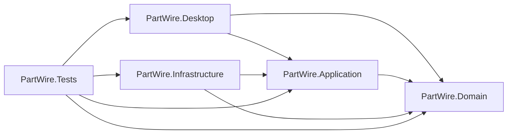

# PartWire ソリューション構成案

## 0. 目的

本書は、実装開始時点のソリューション構成とプロジェクト境界を定義する。

## 1. 初期構成

初期構成は次を推奨する。

- `PartWire.Desktop`
- `PartWire.Application`
- `PartWire.Domain`
- `PartWire.Infrastructure`
- `PartWire.Tests`

## 2. 依存方向

補足:

- `Desktop` から `Infrastructure` を直接参照してもよいが、依存注入境界だけにとどめる
- 画面コードから EF Core へ直接触れない

## 3. プロジェクトごとの責務

### 3.1 PartWire.Desktop

- `App.xaml`
- Shell
- View
- ViewModel
- Navigation
- Dialog
- Desktop 用 DI 起動

### 3.2 PartWire.Application

- UseCase
- Command / Query
- DTO
- Interface
- Validation

### 3.3 PartWire.Domain

- Entity
- Value Object
- Enum
- Domain Service
- Domain Exception

### 3.4 PartWire.Infrastructure

- EF Core
- Repository 実装
- Query 実装
- 認証実装
- 添付、通知、採番、監査の実装

### 3.5 PartWire.Tests

- Domain テスト
- Application テスト
- Infrastructure の最低限統合テスト

## 4. 推奨フォルダ構成

### 4.1 Desktop

- `Views`
- `ViewModels`
- `Navigation`
- `Dialogs`
- `Resources`
- `Styles`
- `Configuration`

### 4.2 Application

- `Projects`
- `Quotations`
- `Orders`
- `Deliveries`
- `Invoices`
- `Masters`
- `Common`

### 4.3 Domain

- `Projects`
- `Quotations`
- `Orders`
- `Deliveries`
- `Invoices`
- `Masters`
- `Common`

### 4.4 Infrastructure

- `Persistence`
- `Persistence/Configurations`
- `Repositories`
- `Queries`
- `Authentication`
- `Files`
- `Notifications`
- `Audit`
- `Numbering`

## 5. NuGet 追加の方向

### 5.1 Desktop

- `CommunityToolkit.Mvvm`
- `Microsoft.Extensions.Hosting`
- `Microsoft.Extensions.Configuration`
- `Microsoft.Extensions.DependencyInjection`
- `Microsoft.Extensions.Logging`

### 5.2 Infrastructure

- `Microsoft.EntityFrameworkCore`
- `Microsoft.EntityFrameworkCore.SqlServer`
- `Microsoft.EntityFrameworkCore.Sqlite`
- `Serilog`
- `Serilog.Extensions.Logging`
- `CsvHelper`

### 5.3 Tests

- `xunit`
- `FluentAssertions`

## 6. 初期実装ルール

- 画面は ViewModel 経由で UseCase を呼ぶ
- UseCase は Interface 経由で Repository / Query を呼ぶ
- EF Core の `DbContext` は Infrastructure 内に閉じ込める
- Domain は UI と EF Core に依存しない

## 7. 次の実作業

この構成を前提に、次の順で作業するとよい。

1. プロジェクト分割
2. DI 起動基盤作成
3. DbContext と EntityTypeConfiguration の配置
4. 初期 ViewModel とナビゲーション骨格作成
